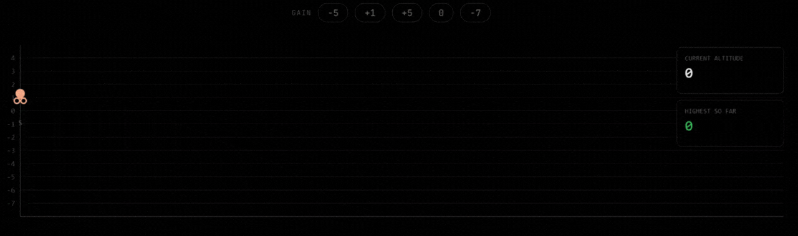

# Visualization


# Intuition
I noticed that the altitude at each point is just the running sum of the gains array. So if I keep adding gains one by one and track the maximum I've seen, I get the answer. The starting altitude is 0, so that's my initial max.

# Approach
Start with altitude 0 and keep a running sum as I walk through the gain array. At each step, update the max altitude seen so far. That's it — one pass, no extra space.


# Complexity
- Time complexity: $$O(n)$$

- Space complexity: $$O(1)$$

# Code
```python3 []
class Solution:
    def largestAltitude(self, gain: List[int]) -> int:
        ans = 0 
        altitude = 0

        for x in gain: 
            altitude += x
            ans = max(ans, altitude)

        return ans
```
```cpp []
class Solution {
public:
    int largestAltitude(vector<int>& gain) {
        int ans = 0, altitude = 0;

        for (int x : gain) {
            altitude += x;
            ans = max(ans, altitude);
        }

        return ans;
    }
};
```
```java []
class Solution {
    public int largestAltitude(int[] gain) {
        int ans = 0, altitude = 0;

        for (int x : gain) {
            altitude += x;
            ans = Math.max(ans, altitude);
        }

        return ans;
    }
}
```
```javascript []
var largestAltitude = function(gain) {
    let ans = 0, altitude = 0;

    for (let x of gain) {
        altitude += x;
        ans = Math.max(ans, altitude);
    }

    return ans;
};
```
```golang []
func largestAltitude(gain []int) int {
    ans, altitude := 0, 0

    for _, x := range gain {
        altitude += x
        if altitude > ans {
            ans = altitude
        }
    }

    return ans
}
```
Please upvote if you find the solution interesting !!!