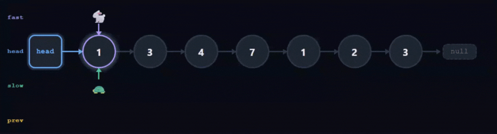

# 2095. Delete the Middle Node of a Linked List

🔗 [LeetCode](https://leetcode.com/problems/delete-the-middle-node-of-a-linked-list/) | 🟡 Medium | Linked List · Two Pointers

---

## Visualization



---

## Intuition

The key idea is to find the middle node without counting the length first.
If one pointer moves twice as fast as the other, when the fast one reaches
the end, the slow one will be exactly at the middle.

---

## Approach

Use three pointers — `fast`, `slow`, and `prev`.

- `fast` moves 2 steps at a time
- `slow` moves 1 step at a time
- `prev` always stays one step behind `slow`

When `fast` hits the end, `slow` is at the middle.
We then do `prev.next = slow.next` to unlink it.

> **Edge case:** if the list has only one node, `prev` stays `null` — return `null` directly.

---

## Complexity

- **Time:** O(n) — single pass through the list
- **Space:** O(1) — only three pointers used

---

## Code

```cpp
class Solution {
public:
    ListNode* deleteMiddle(ListNode* head) {
        if (head == nullptr) return nullptr;
        ListNode* fast = head;
        ListNode* slow = head;
        ListNode* prev = nullptr;
        while (fast != nullptr && fast->next != nullptr) {
            prev = slow;
            slow = slow->next;
            fast = fast->next->next;
        }
        if (prev == nullptr) head = head->next;
        else prev->next = slow->next;
        return head;
    }
};
```

```java
class Solution {
    public ListNode deleteMiddle(ListNode head) {
        if (head == null) return null;
        ListNode fast = head, slow = head, prev = null;
        while (fast != null && fast.next != null) {
            prev = slow;
            slow = slow.next;
            fast = fast.next.next;
        }
        if (prev == null) head = head.next;
        else prev.next = slow.next;
        return head;
    }
}
```

```python
class Solution:
    def deleteMiddle(self, head: Optional[ListNode]) -> Optional[ListNode]:
        if not head:
            return None
        fast, slow, prev = head, head, None
        while fast and fast.next:
            prev = slow
            slow = slow.next
            fast = fast.next.next
        if prev is None:
            head = head.next
        else:
            prev.next = slow.next
        return head
```

```javascript
var deleteMiddle = function(head) {
    if (!head) return null;
    let fast = head, slow = head, prev = null;
    while (fast !== null && fast.next !== null) {
        prev = slow;
        slow = slow.next;
        fast = fast.next.next;
    }
    if (prev === null) head = head.next;
    else prev.next = slow.next;
    return head;
};
```

```go
func deleteMiddle(head *ListNode) *ListNode {
    if head == nil {
        return nil
    }
    fast, slow, prev := head, head, (*ListNode)(nil)
    for fast != nil && fast.Next != nil {
        prev = slow
        slow = slow.Next
        fast = fast.Next.Next
    }
    if prev == nil {
        head = head.Next
    } else {
        prev.Next = slow.Next
    }
    return head
}
```

---

*[← Back to Linked List](../README.md)*