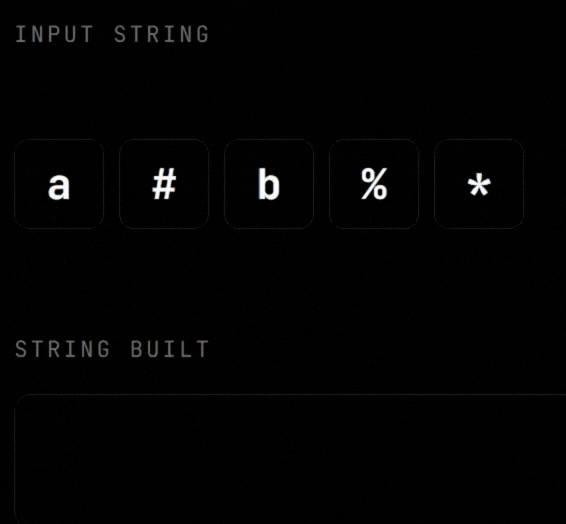
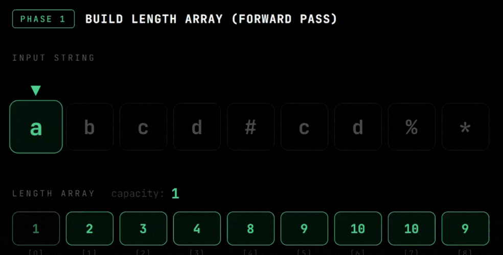

# [3614. Process String with Special Operations II](https://leetcode.com/problems/process-string-with-special-operations-ii/)

# Intuition

The most natural approach is to just simulate it — read left to right, maintain a result string, apply each operation as you go. Simple and clean.

But there's a catch. Let me show you why that breaks first.

---

## Visualization



---

# Brute Force — Build the Actual String

Read the string left to right and apply each rule directly:

- Letter → append it
- `*` → delete the last character
- `#` → duplicate the string
- `%` → reverse the string

At the end return `result[k]` or `'.'` if k is out of bounds.

```cpp []
class Solution {
public:
    string revString(string s) {
        int left = 0, right = s.length() - 1;
        while (left < right) {
            swap(s[left], s[right]);
            left++; right--;
        }
        return s;
    }
    char processStr(string s, long long k) {
        int n = s.length();
        string result;
        for (int i = 0; i < n; i++) {
            if (s[i] >= 'a' && s[i] <= 'z') result += s[i];
            else if (s[i] == '*') { if (!result.empty()) result.pop_back(); }
            else if (s[i] == '#') result += result;
            else if (s[i] == '%') result = revString(result);
        }
        return k >= result.length() ? '.' : result[k];
    }
};
```
```java []
class Solution {
    public char processStr(String s, long k) {
        int n = s.length();
        StringBuilder result = new StringBuilder();
        for (int i = 0; i < n; i++) {
            char c = s.charAt(i);
            if (c >= 'a' && c <= 'z') result.append(c);
            else if (c == '*') { if (result.length() > 0) result.deleteCharAt(result.length() - 1); }
            else if (c == '#') result.append(result.toString());
            else if (c == '%') result.reverse();
        }
        return k >= result.length() ? '.' : result.charAt((int) k);
    }
}
```
```python []
class Solution:
    def processStr(self, s: str, k: int) -> str:
        result = []
        for c in s:
            if c.islower(): result.append(c)
            elif c == '*':
                if result: result.pop()
            elif c == '#': result += result[:]
            elif c == '%': result.reverse()
        return '.' if k >= len(result) else result[k]
```
```javascript []
var processStr = function(s, k) {
    let result = [];
    for (let c of s) {
        if (c >= 'a' && c <= 'z') result.push(c);
        else if (c === '*') { if (result.length) result.pop(); }
        else if (c === '#') result = result.concat(result);
        else if (c === '%') result.reverse();
    }
    return k >= result.length ? '.' : result[k];
};
```
```go []
func processStr(s string, k int64) byte {
    result := []byte{}
    for _, c := range s {
        if c >= 'a' && c <= 'z' { result = append(result, byte(c))
        } else if c == '*' {
            if len(result) > 0 { result = result[:len(result)-1] }
        } else if c == '#' { result = append(result, result...)
        } else if c == '%' {
            for l, r := 0, len(result)-1; l < r; l, r = l+1, r-1 {
                result[l], result[r] = result[r], result[l]
            }
        }
    }
    if k >= int64(len(result)) { return '.' }
    return result[k]
}
```

---

# Why This Fails ❌

The constraint says the result length won't exceed **10¹⁵**.

Every `#` doubles the string. Chain just 50 of them:
"a" → "#" → "aa" → "#" → "aaaa" → ... → 2^50 characters

2^50 = 1,125,899,906,842,624

You cannot store that in memory. Your RAM explodes long before you finish.
We need to never build the string at all.

---

# Optimised — Trace Backwards

## Visualization




---

## The Core Idea

Instead of building the string and finding `k`, we flip the question.

> *"Where did position k come from, one step earlier?"*

We walk **backwards** through `s` and at each step we update `k` to reflect
where it would have originated before that operation happened.
When we hit a letter that owns that position, we return it.

---

## Step 1 — Build the Length Array

First pass left to right — just track what the **length** of the result
would be after each character. No actual string stored.
s = "ab#%*"
'a' → length = 1

'b' → length = 2

'#' → length = 4

'%' → length = 4   (reverse doesn't change length)

'*' → length = 3
lengthArray = [1, 2, 4, 4, 3]

---

❓ **Why do we need the length array?**

Because when we walk backwards, at every step we need to know two things — what was the length of the string *at this exact moment* and what was it just *before this character was processed*.

Without the length array we would have no way to know either of those.

For example when we hit `#` going backwards, we need `prevLen` to do `k % prevLen`.
When we hit `%` we need `currLen` to do `currLen - 1 - k`.
When we hit a letter we need `currLen` to check if `k == currLen - 1`.

Every single backwards step depends on these lengths.
We compute them cheaply in one forward pass so the backward pass has everything it needs.

---

❓ **What does it mean when `currLen - 1 == k`?**

A letter always appends itself at the very **end** of the result string.
So the moment it gets added, it sits at index `currLen - 1` which is the last position.

If `k == currLen - 1`, it means the position we are searching for is exactly
where this letter just landed. We found our answer, return it.

If `k` is anything less than `currLen - 1`, this letter is not our target.
It was appended after the character we are looking for already existed,
so we ignore it and keep walking left.
result before = "ab"   (length 2, indices 0 and 1)

append 'c'    → "abc"  (length 3, currLen = 3)

'c' sits at index 2 = currLen - 1 = 3 - 1 = 2
if k == 2 → return 'c'

if k == 0 or 1 → 'c' is not our answer, keep going

---

## Step 2 — Walk Backwards and Update k

Now go right to left. For each character we know:
- `currLen` = `lengthArray[i]` — length after this step
- `prevLen` = `lengthArray[i-1]` — length just before this step

---

## Understanding Each Case

**When we hit a letter**

A letter always appends itself at the very end. So it sits at index `currLen - 1`.

If `k == currLen - 1` → this letter is at position k. Return it.
If not → this letter is not what we want, keep going left.

---

**When we hit `#`**

`#` duplicated the string. Both halves are identical copies.
"abc" → "#" → "abcabc"

k=4 came from k=1  →  4 % 3 = 1

k=5 came from k=2  →  5 % 3 = 2

So we do `k = k % prevLen` to fold k back into the first half.

> **Why prevLen?** It is the length of one copy. Modulo maps any position
> in the doubled string back into that one copy.

---

**When we hit `%`**

`%` reversed the string. What is now at index `k` was originally at the mirror position.
"abcd" → "%" → "dcba"

k=0 in "dcba" was at k=3 in "abcd"  →  4-1-0 = 3

k=1 in "dcba" was at k=2 in "abcd"  →  4-1-1 = 2

So we do `k = currLen - 1 - k`.

> **Why currLen - 1 - k?** Reversing mirrors every index around the centre.
> Index 0 swaps with the last, index 1 swaps with second last, and so on.

---

**When we hit `*`**

`*` only removes the last character. Every other character keeps its exact index.
So k does not change at all — just keep walking left.

---

## Code

```cpp []
class Solution {
public:
    vector<long long> buildLenArray(string s) {
        vector<long long> ans;
        long long capacity = 0;
        for (char c : s) {
            if (c >= 'a' && c <= 'z') capacity++;
            else if (c == '#') capacity *= 2;
            else if (c == '*') { if (capacity > 0) capacity--; }
            ans.push_back(capacity);
        }
        return ans;
    }
    char processStr(string s, long long k) {
        int n = s.length();
        vector<long long> lengthArray = buildLenArray(s);
        if (k >= lengthArray[n - 1]) return '.';
        for (int i = n - 1; i >= 0; i--) {
            char ch = s[i];
            long long currLen = lengthArray[i];
            long long prevLen = (i == 0) ? 0 : lengthArray[i - 1];
            if (ch >= 'a' && ch <= 'z') {
                if (k == currLen - 1) return ch;
            }
            else if (ch == '#') { k = k % prevLen; }
            else if (ch == '%') { k = currLen - 1 - k; }
            // '*' → k stays the same
        }
        return '.';
    }
};
```
```java []
class Solution {
    private long[] buildLenArray(String s) {
        long[] arr = new long[s.length()];
        long capacity = 0;
        for (int i = 0; i < s.length(); i++) {
            char c = s.charAt(i);
            if (c >= 'a' && c <= 'z') capacity++;
            else if (c == '#') capacity *= 2;
            else if (c == '*') { if (capacity > 0) capacity--; }
            arr[i] = capacity;
        }
        return arr;
    }
    public char processStr(String s, long k) {
        int n = s.length();
        long[] lengthArray = buildLenArray(s);
        if (k >= lengthArray[n - 1]) return '.';
        for (int i = n - 1; i >= 0; i--) {
            char ch = s.charAt(i);
            long currLen = lengthArray[i];
            long prevLen = (i == 0) ? 0 : lengthArray[i - 1];
            if (ch >= 'a' && ch <= 'z') {
                if (k == currLen - 1) return ch;
            } else if (ch == '#') { k = k % prevLen;
            } else if (ch == '%') { k = currLen - 1 - k; }
            // '*' → k unchanged
        }
        return '.';
    }
}
```
```python []
class Solution:
    def buildLenArray(self, s: str) -> list:
        arr = []
        capacity = 0
        for c in s:
            if c.islower(): capacity += 1
            elif c == '#': capacity *= 2
            elif c == '*': capacity = max(0, capacity - 1)
            arr.append(capacity)
        return arr
    def processStr(self, s: str, k: int) -> str:
        n = len(s)
        length_array = self.buildLenArray(s)
        if k >= length_array[-1]:
            return '.'
        for i in range(n - 1, -1, -1):
            ch = s[i]
            curr_len = length_array[i]
            prev_len = 0 if i == 0 else length_array[i - 1]
            if ch.islower():
                if k == curr_len - 1: return ch
            elif ch == '#': k = k % prev_len
            elif ch == '%': k = curr_len - 1 - k
            # '*' → k unchanged
        return '.'
```
```javascript []
var processStr = function(s, k) {
    const n = s.length;
    const lengthArray = [];
    let capacity = 0n;
    k = BigInt(k);
    for (let c of s) {
        if (c >= 'a' && c <= 'z') capacity++;
        else if (c === '#') capacity *= 2n;
        else if (c === '*') { if (capacity > 0n) capacity--; }
        lengthArray.push(capacity);
    }
    if (k >= lengthArray[n - 1]) return '.';
    for (let i = n - 1; i >= 0; i--) {
        const ch = s[i];
        const currLen = lengthArray[i];
        const prevLen = i === 0 ? 0n : lengthArray[i - 1];
        if (ch >= 'a' && ch <= 'z') {
            if (k === currLen - 1n) return ch;
        } else if (ch === '#') { k = k % prevLen;
        } else if (ch === '%') { k = currLen - 1n - k; }
        // '*' → k unchanged
    }
    return '.';
};
```
```go []
func processStr(s string, k int64) byte {
    n := len(s)
    lengthArray := make([]int64, n)
    var capacity int64
    for i, c := range s {
        if c >= 'a' && c <= 'z' { capacity++
        } else if c == '#' { capacity *= 2
        } else if c == '*' && capacity > 0 { capacity-- }
        lengthArray[i] = capacity
    }
    if k >= lengthArray[n-1] { return '.' }
    for i := n - 1; i >= 0; i-- {
        ch := s[i]
        currLen := lengthArray[i]
        var prevLen int64
        if i > 0 { prevLen = lengthArray[i-1] }
        if ch >= 'a' && ch <= 'z' {
            if k == currLen-1 { return ch }
        } else if ch == '#' { k = k % prevLen
        } else if ch == '%' { k = currLen - 1 - k }
        // '*' → k unchanged
    }
    return '.'
}
```

---

# Complexity

**Brute Force**
- Time — O(n · L) where L can reach 10¹⁵. Completely unusable.
- Space — O(L) to store the actual string. Memory explodes.

**Optimised**
- Time — O(n). Two passes over s, nothing else.
- Space — O(n). Just the length array, nothing more.